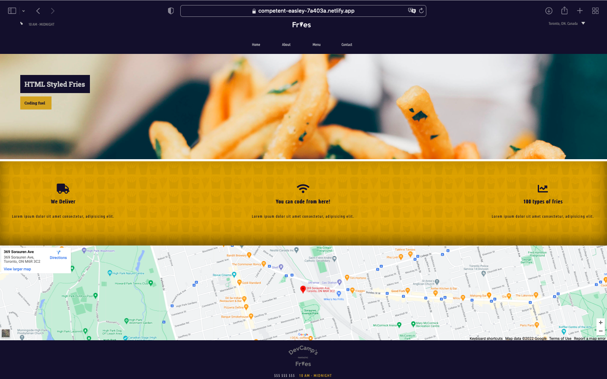
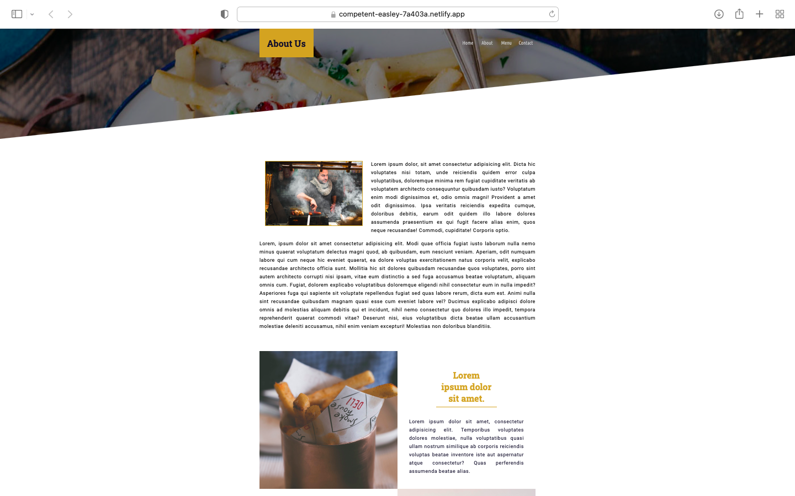
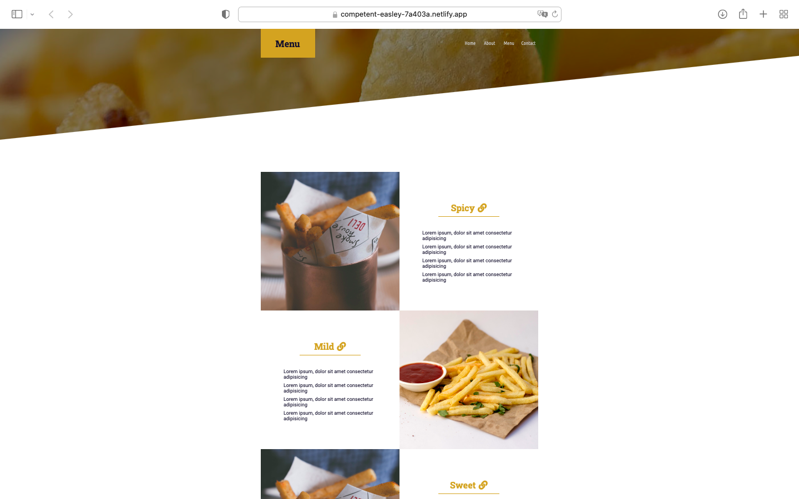
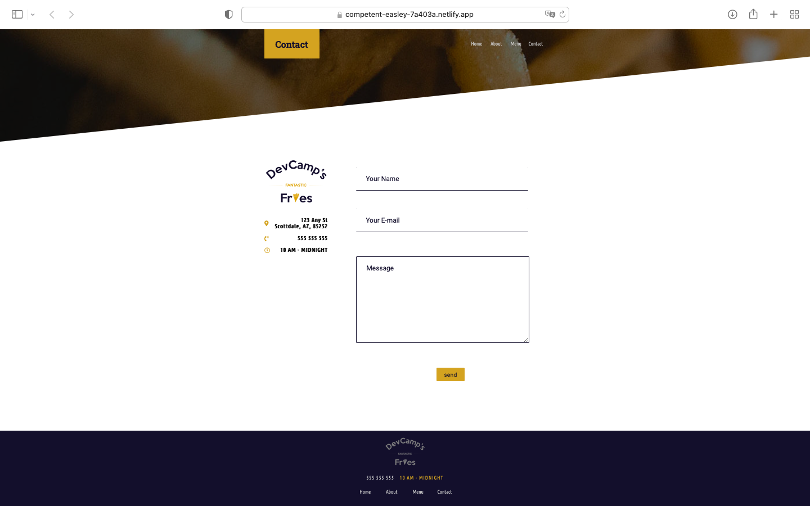

### Quik Intro :

A website for a fictitious restaurant.

---

### App Screenshots :

---

---

#### Home page

---

#### About page

---

#### Menu page

---

#### Contact page

---

---

### Technologies Used :

1. HTML
2. CSS
3. Media Queries
4. CSS grid
5. Flex-box
6. CDN libraries
7. Google maps
8. git
9. gitHub
10. Netlify

---

### [link](https://competent-easley-7a403a.netlify.app) to the website

---
